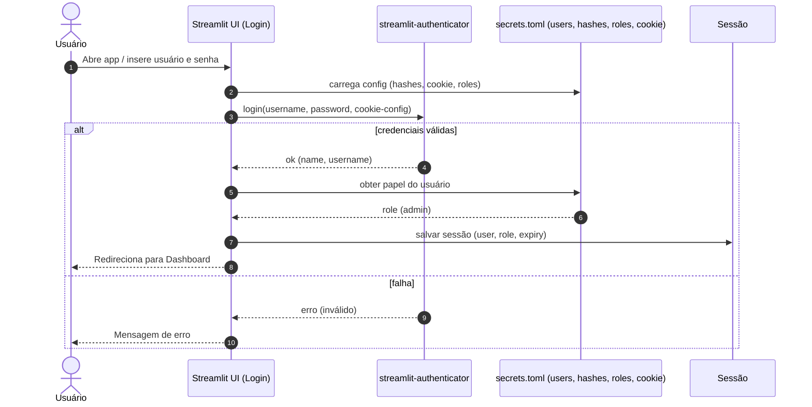
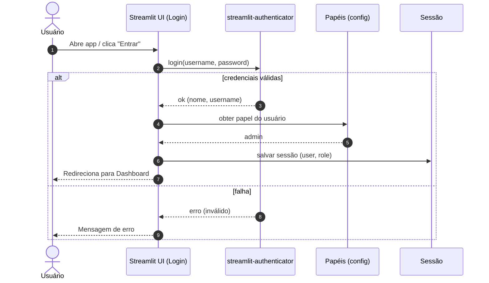
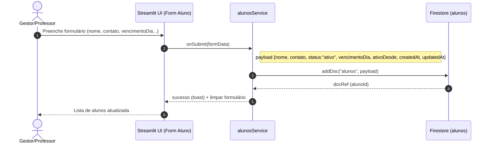
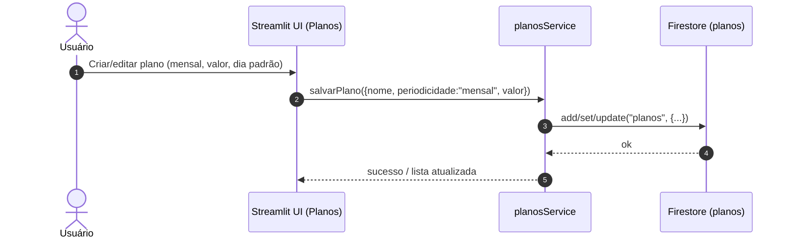
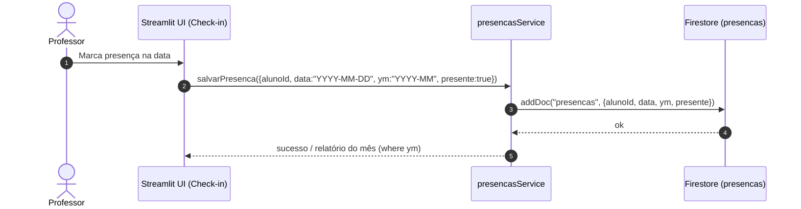
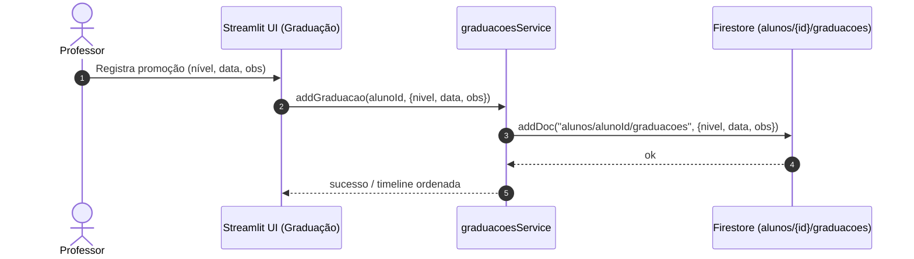
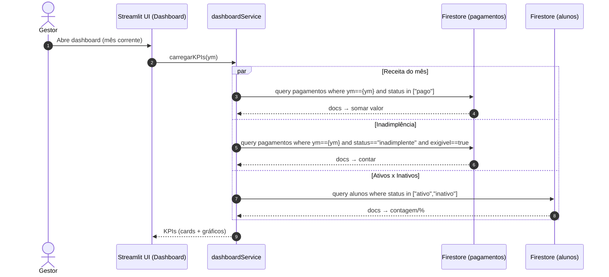

# DIAGRAMAS_SEQUENCIA_MVP.md
Sequência dos principais fluxos do MVP — **Streamlit + Firestore**  
Cada diagrama foi separado por contexto para facilitar revisão e evolução.

> Observação: sem pagamento trimestral neste MVP. Somente **mensal**.

---

## 1) Autenticação (streamlit-authenticator, sem Google)



---

## 2) Cadastro de Aluno


---

## 3) Planos (CRUD)


---

## 4) Pagamento Mensal (ID estável + ym)
```mermaid
sequenceDiagram
  autonumber
  actor Financeiro as Financeiro
  participant UI as Streamlit UI (Registrar Pagamento)
  participant PgtoSvc as pagamentosService
  participant FS as Firestore (pagamentos)

  Financeiro->>UI: Seleciona aluno, ano, mês, valor
  UI->>PgtoSvc: registrarPagamento({alunoId, alunoNome, ano, mes, valor, status:"pago"})
  note right of PgtoSvc: ym = "YYYY-MM"; docId = "alunoId_YYYY_MM"; alunoNome denormalizado p/ listagens
  PgtoSvc->>FS: setDoc("pagamentos/docId", {alunoId, alunoNome, ano, mes, ym, valor, status:"pago", exigivel:true, paidAt:serverTs, createdAt, updatedAt}, {merge:true})
  FS-->>PgtoSvc: ok
  PgtoSvc-->>UI: sucesso / atualizar extrato (orderBy ym desc)
```

---

## 5) Presenças (Check-in)


---

## 6) Graduação (Subcoleção do Aluno)


---

## 7) Dashboard (KPIs por ym)
